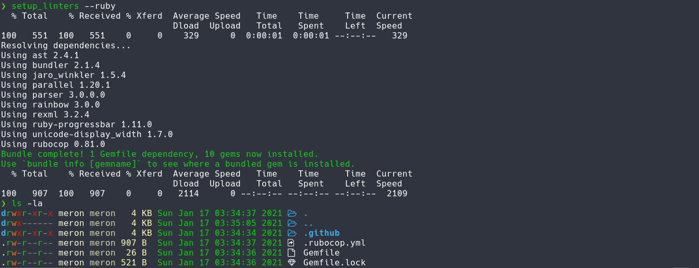

# Microverse Linters Setup

> This is a bash script that lets you install and setup linters quickly for the programming languages used in the Microverse curriculum.

The script supports the following options:

|Flag         |Description                    |
|-------------|-------------------------------|
|--html       |setup html&css linters         |
|--ruby       |setup ruby linters             |
|--rails      |setup rails linters            |
|--javascript |setup javascript linters       |
|--react      |setup react-redux linters      |
|--help       |list all the available options |

## Dependencies

If you're on Linux or macOS, you should have these pre-installed by default.

- bash
- curl

## Installation

Run the following commands one by one to install this script to your system.

1. `mkdir -p ~/bin`
1. `curl https://raw.githubusercontent.com/meronokbay/microverse-linters-setup/main/setup_linters -o ~/bin/setup_linters`
1. `chmod +x ~/bin/setup_linters`
1. `echo "export PATH=~/bin:\$PATH" >> ~/.bashrc`

**Note**: If you're using zsh as your shell, replace `.bashrc` in the above command with `.zshrc`.

## Usage

1. `cd` into your project directory.
1. Run `setup_linters --help` to view the available languages.
1. Run the script with the programming language of your project and you're good to go.

## Authors

👤 **Meron Ogbai**

- Github: [@meronokbay](https://github.com/meronokbay)
- Twitter: [@MeronDev](https://twitter.com/MeronDev)
- Linkedin: [Meron Ogbai](https://linkedin.com/in/meron-ogbai/)

## 🤝 Contributing

Contributions, issues, and feature requests are welcome!

## Show your support

Give a ⭐️ if you like this project!

## Acknowledgements

[Linters Config](https://github.com/microverseinc/linters-config)

## 📝 License

This project is [MIT](./LICENSE) licensed.
